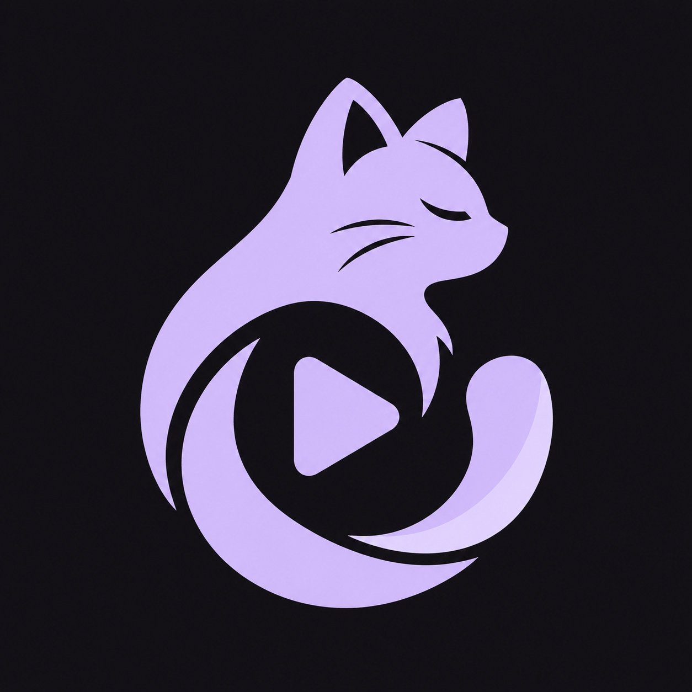

<p align="center">
  
</p>

# NekoStream Mobile

Standalone React Native client for AniList, MyAnimeList, and Nyaa. The app
stores its library, Nyaa filters, and discovered episodes on the device. It
builds and runs independently from the NekoStream server repository.

## Development and release

See [Running the mobile app](mobile-runbook.md) for prerequisites, the debug
build + Metro workflow, release APK signing, and device troubleshooting.

```bash
npm ci
npm run typecheck
npm run lint
npm run android:dev
```

Use `npm run dev` with the installed **NekoStream Dev** app for Fast Refresh.
The development app is separate from the release app and keeps its own data.

Expo Go cannot run this app: it requires a custom native binary for the
`nekostream://` OAuth callbacks, native SQLite/SecureStore modules, and the
Android torrent player.

## Torrent playback

On Android 9 or newer, Nyaa releases offer **Play** beside **Open magnet**.
Play fetches torrent metadata, selects a video file, and streams verified
pieces through a loopback HTTP server to the in-app video player. The active
stream shows a foreground notification when notification permission is granted.
Leaving the player stops the torrent session and removes its temporary cache.
Playback depends on available peers and codecs supported by the device.

## Project layout

- `src/` — application UI, on-device database, authentication, and sync.
- `shared/lib/` — portable domain modules copied from the server project and
  used through the `@shared/*` alias. These are vendored source files, not a
  runtime or build-time dependency on the server checkout.
- `drizzle/` — generated SQLite migrations shipped in the app bundle.

The source of the vendored modules is the server repository's `src/lib/`.
When changing one side, review the corresponding module in the other project
and keep intentional differences documented.
